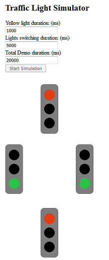
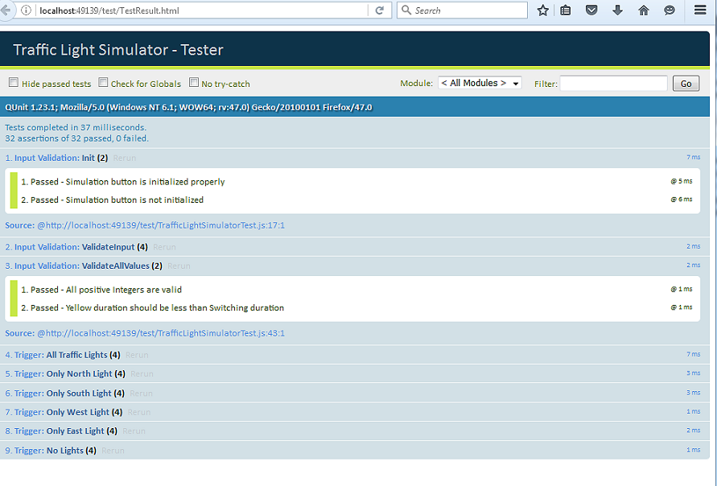

# Traffic Light Simulator

Traffic Light simulator is web based simple traffic lights control simualtion at four way intersection.

  - code developed using HTML, CSS, Javascript and JQuery.
  - Unit test code developed using QUnit test framework.

External Dependencies:
  - Jquery
  - QUnit for UNit testing
  - 
### Screen shots:





### Steps to run application & Unit testing

* To see output, open index.html (located in root directory) in any browser.
* To run Unit testing, open TestResult.html (/test directory) in any browser.

### Folder structure:

```sh
--Root
--------index.html
--------src
          ----- TrafficLightSimulator.js
          ----- TrafficLightSimulator.css
--------test
          ----- TestResults.html
          ----- TrafficLightSimulatorTest.js
--------screenshots
--------docs
```
----- Document ends here ------


